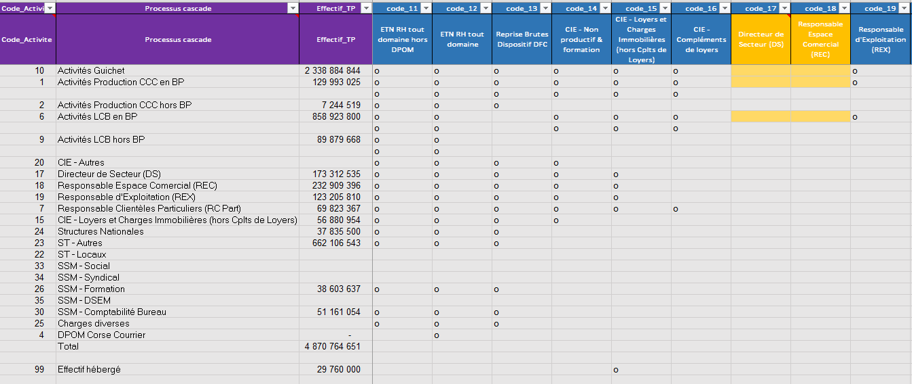
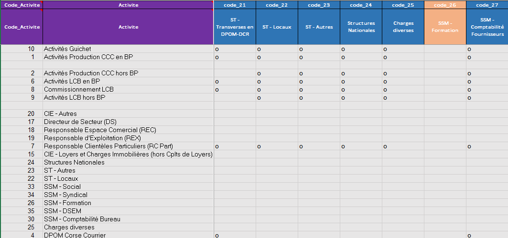

```{r setup, include=FALSE}
library(tidyverse)
library(ggplot2)
library(readr)
library(stringi)
library(knitr)
library(kableExtra)
library(data.table)
library(microbenchmark)

# Définition du chemin de travail
setwd("W:/01 - Projets/Cascade des coûts/Cascade/OLD")
```

# Introduction
Ce document explique les différentes étapes de la construction de la cascade des coûts. Pour faciliter l'explication du processus, nous avons découpé les activités en 3 classes :

* `CDO`: Ce sont les charges directes opérationnelles. Elles représentent les activités sur lesquelles les charges des autres activités doivent être ventilées. Elles sont indexées par les codes 1 à 25.
* `CIO` : Charges indirectes opérationnelles. Ce sont des charges à ventiler selon des codes temps. Elles sont indexées par les codes 26 à 35.
* `CSS` : Charges de Structures et de support. Ce sont les autres charges qui se vnetilent selon les clés temps ou les clés au taux de frais ou encore les deux. Elles sont indexées par les codes 36 à 61.

# Importation des fichiers de paramétrage
Dans un premier temps, on importe les fichiers de paramétrage qui seront utilisés dans le calcul des clés de répartition des charges. Ici, nous importons les fichiers suivant :


* Le paramétrage pour le calcul des clés temps
* Le paramétrage des marquages d'activités dans lequel tout se repose sur les codes activités
* Le paramétrage pour la construction des clés de taux de frais qui sont des clés qui se baseront sur les charges directes et les charges issues de la ventilation des coûts via les clés temps.
* Les données brutes : Pour ces données, dans un premier temps nous avons utilisé les charges après retraitement. Ceci sera corrigé après les vérifications pour stabiliser l'outil. À noter que ces données pour faciliter le traitement dans l'outil seront au format csv.

```{r message=FALSE, warning=FALSE}

################################
# Le paramétrage des clés temps#
################################

param_temps <- read_delim("param_temps .csv", 
    ";", escape_double = FALSE, locale = locale(encoding = "ISO-8859-2"), 
    trim_ws = TRUE)

param_temps <- param_temps %>%
    mutate(temps_min = if_else(is.na(temps_min), 0, temps_min))%>%
  filter(Code_Activite>0)

param_tf <- read_delim("param_tf.csv", 
    ";", escape_double = FALSE, locale = locale(encoding = "ISO-8859-2"), 
    trim_ws = TRUE)

marquage <- read_delim("marquage.csv", 
    ";", escape_double = FALSE, locale = locale(encoding = "ISO-8859-2"), 
    trim_ws = TRUE)


data <- read_delim("data.csv", 
    ";", escape_double = FALSE, locale = locale(encoding = "ISO-8859-2"), 
    trim_ws = TRUE)

#Valeurs en dur pour le traitement activité 30
charge_heberge_facteur=12537410.3015909


# Formation
prestation_formation=5308121 # A soustraire des charge du code 41
Formation_LCB=12625761 #??? A allouer à l'activité 7
```

# Marquage de la base de charge piloté

Le marquage de la base des charges consiste à associer à chaque opération le code activité correspondant. Pour ce faire, nous avons besoin de 4 élément qui nous permettent de construire un identifiant. Ces 4 élément sont la concaténation de :

* Le code du processus cascade qui est au format `PCXXX` X représentant un chiffre
* Le code de l'activité métier qui est au format `AMXXXX`
* Le code de l'activité Cascade qui est au format `ACXX`
* Le code du label Analytique qui est au format `AAAAAA` A représentant une lettre


Grâce à ces 4 éléments, on construit la clé au format **`PCXXXAMXXXXACXXAAAAAA`**. De là, nous associons à chaque identifiant l'activité correspondante.


# Construction des clés 
Nous allons expliciter ici la construction des clés temps et des clés au taux de frais.


## Construction des clés temps pour les activités à ventiler

### Méthodologie
Dans cette partie, nous construirons les clés temps et par la même occasion les coûts intermédiaires ventilés grâce à ces clés temps.
Nous partons de la matrice de paramétrage qui a été importée ci-haut.

Le fichier de paramétrage contient les éléments suivants :

* Les 2 premières colonnes décrivent les codes et les libellés pour lesquels on doit calculer les clés temps. Les codes en ligne contiennent à la fois des activités opérationnelles COD, mais aussi les autres activités qui doivent être ventilées avec les clés temps.
* la 3 ème colonne décrit les temps agent alloué à l'activité
* les autres colonnes décrivent COI et les CSS qui doivent être ventilées sur les activités en lignes. Ainsi si pour une colonne on met 'o' pour une activité cela signifie que les charges de cette activité doivent être ventilées sur l'activité en ligne correspondante.

Cette façon de faire, suppose donc que nous devons connaitre en amont les charges des différentes activités qui sont en colonne. Cette information se trouve dans la base de charge avec la colonne **Ch_AP_Ret** qui représente les charges après retraitement.
Essayons de formaliser mathématiquement le calcul des clés temps.


* Soit $K=(1,...,k...,K)$ l'ensemble des activités sur lesquels on doit calculer des clés temps
* Soit $J=(1,...,j...,J)$ l'ensemble des activités pour lesquels on doit ventiler des charges.
* Soit $T_{k}$ le temps alloué à l'opération $k$
* Soit $\mathbb{1}_{k}(o)$ la fonction indicatrice qui indique si une activité de l'ensemble $J$ doit être ventilé sur l'activité $k$ de l'ensemble $K$. Cette fonction représente le fichier de paramétrage avec les options "o"
* Soit $W_{k}^{j}$ la clé temps de l'activité $j$ à ventiler sur l'activité $k$ 

$$ W_{k}^{j}=\frac{T_{k}*\mathbb{1}_{k}(o) }{\sum_{i \in (\mathbb{1}_{k}(o)}\mathbb{1}_{i}(o)*T_{i} }$$
Traduit latéralement, cette formule signifie que le poids d'une activité est égal au rapport de son temps sur la somme des temps des activité sur laquelle la charge doit être ventilée.

Ce poids est appliqué à la charge après traitement des opérations à ventiler. Soit $Charge_{k}^{j}$ la charge de l'opération $j$ à ventiler sur l'opération $k$, nous aurons donc :
$$ChargeETP_{k}^{j}=Charge_{k}^{j}*W_{k}^{j}$$

```{r message=FALSE}
# Jointure de la table des données avec la table de marquage et création de la variable de code
data<-data %>% left_join(marquage[,9:13])%>%
              mutate(code=stri_replace_all_fixed(paste('code_',Code_manuel), " ", ""),
                     Ch_AP_Ret=ifelse(is.na(Ch_AP_Ret),0,Ch_AP_Ret))

# Calcul des charges intermédiaires pour la construction des taux de frais
#Cette table sera utilisée dans la suite pour le calcul des clés au taux de frais
Charges_for_etp<-data%>% 
    group_by(code)%>%
     summarise(charges_etp=sum(Ch_AP_Ret))

a<-as.data.frame(t(Charges_for_etp))
a<-a[-1,]
colnames(a)<-t(Charges_for_etp[,1])
a<- data.frame(lapply(a, function(x) as.numeric(as.character(x))))


## Calcul des charges 
a<-a[,c(#'code_1','code_2','code_3','code_4','code_5','code_6','code_7','code_8','code_9','code_10',
'code_11','code_12','code_13','code_14','code_15','code_16','code_17','code_18','code_19','code_20','code_21',
'code_22','code_23','code_24','code_25','code_26','code_27','code_28','code_29','code_30','code_31','code_32','code_33','code_34','code_35','code_36','code_37','code_38','code_39','code_40','code_41','code_42','code_43','code_44',
'code_45','code_46')
]


#Stockage des variables concernées : ce sont les variables en colonne
liste_col=colnames(param_temps)[4:length(colnames(param_temps))]


cle_temps<-param_temps[,1:2]

#Boucle pour construire la variable de clé temps en fonction des effectifs temps
for (i in 1:length(liste_col))
{
  # Nouvelle variable de clé
  var<-stri_replace_all_fixed( paste("weight_",liste_col[i]), " ", "")
  #Variable sur laquelle calculer la clé
  code<-stri_replace_all_fixed(liste_col[i]," ","")
  # Construction de la variable
  cle_temps[[paste(var)]]=ifelse(param_temps[[paste(code)]]!="o",0,
                              param_temps$temps_min/sum(param_temps[which(param_temps[[paste(code)]]=="o"),]$temps_min))
#}
  # Traitement des cas particuliers où un seul poids existe, on fait le rapport sur la somme des effectifs
  cle_temps[[paste(var)]]<-ifelse(param_temps[[paste(code)]]=="o" 
                                    & param_temps$Code_Activite==99 
                                    #& param_temps[[paste(var)]]==a[1,i]
                                ,(param_temps$temps_min/sum(param_temps$temps_min))
                                ,cle_temps[[paste(var)]])
 
}

## traitement spécifique
cle_temps$weight_code_17<-param_temps$code_17
cle_temps$weight_code_18<-param_temps$code_18


###################################################################################################################
#Boucle pour construire la variable des charges intermédiaires avec les clés temps en fonction des effectifs temps#
###################################################################################################################
for (i in 1:length(liste_col))
{
  # Nouvelle variable de clé
  var<-stri_replace_all_fixed( paste("weight_",liste_col[i]), " ", "")
  #Variable sur laquelle calculer la clé
  code<-stri_replace_all_fixed(liste_col[i]," ","")
  # Construction de la variable
  param_temps[[paste(var)]]=a[1,i]*ifelse(param_temps[[paste(code)]]!="o",0,
                              param_temps$temps_min/sum(param_temps[which(param_temps[[paste(code)]]=="o"),]$temps_min))
#}
  # Traitement des cas particuliers où un seul poids existe, on fait le rapport sur la somme des effectifs
  param_temps[[paste(var)]]<-ifelse(param_temps[[paste(code)]]=="o" 
                                    & param_temps$Code_Activite==99 
                                    #& param_temps[[paste(var)]]==a[1,i]
                                ,a[1,i]*(param_temps$temps_min/sum(param_temps$temps_min))
                                ,param_temps[[paste(var)]])
 
  param_temps[[paste(code)]]<-NULL
}


#kable(param_temps[1:5,1:6], caption = "Extrait de la table des charges ETP")
#datatable(param_temps[,1:6], rownames = FALSE)
```

Voici ci-dessous les charges apés traitement par activité issue de la base des charges
```{r message=FALSE, warning=FALSE}
kable(a, "html",caption = "Les charges apés traitement par activité issue de la base des charges") %>%
  kable_styling() %>%
  scroll_box(width = "1000px", height = "200px")
```

Ci-dessous, la matrice des clés temps
```{r message=FALSE, warning=FALSE}
kable(cle_temps, "html",caption = "Matrice des clés temps") %>%
  kable_styling() %>%
  scroll_box(width = "1000px", height = "300px")

```

Ci-dessous la matrice des charges obtenus par ventilation avec les clés temps

```{r message=FALSE, warning=FALSE}
kable(param_temps, "html",caption = "Matrice des charges obtenus par ventilation avec les clés temps") %>%
  kable_styling() %>%
  scroll_box(width = "1000px", height = "300px")
```


Le programme ci-dessus nous a permis de calculer les clés temps, mais aussi les charges intermédiaires liées à ces clés temps. 

#### Mise à jour des clés intermédiaires ventilé.

Nous savons que certains COI sont répartis sur d'autres COI qui sont eux même répartis sur les COD. Il convient donc de metrre à jour les clés sur les COI des activités qui ont un bout qui est réparti sur les autres COI.\n
Dans cette partie, nous allons nous atteler à cette tâche.
```{r message=FALSE, warning=FALSE}
# Selection des codes activité 1 à 10: les COD
cle_ini<-cle_temps%>%
  filter(Code_Activite%in%c(1:10))%>%
  arrange(Code_Activite)

# On remplace les valeurs manquantes par zeros
cle_ini[is.na(cle_ini)]<-0

# On selectionne cléssur les COD des activités COI qui se déversent dans d'autres COI
cle_int<-cle_ini%>%
  select(c("weight_code_15",
"weight_code_17",
"weight_code_18",
"weight_code_19",
"weight_code_23",
"weight_code_24",
"weight_code_26",
"weight_code_30"))
  
# transoposition de la matrice pour faciliter les opérations de calcul
cle_int<-as.data.frame(t(cle_int))[,-3] 

# Clé des COI qui se déversent sur les autres COI
cle_venti<-cle_temps%>%
  filter(Code_Activite%in%c(15,
                          17,
                          18,
                          19,
                          23,
                          24,
                          26,
                          30))%>%
  arrange(Code_Activite)%>%
  select(3:7)
  
cle_venti[is.na(cle_venti)]<-0  

# Append des deux tables 
cle_venti<-cbind(cle_venti,cle_int)


## Cette fonction permet de calculer la clé correcte des COD pour les COI qui se déversent sur d'autre COI
correct_cle <- function(data, cle){
var<-data[[paste(cle)]]
test<-data%>%
          mutate_each(funs(.*var), starts_with("V"))
test<-test %>% summarize_each(funs(sum), starts_with("V"))  
test<-as.data.frame(t(test))


insertRow <- function(existingDF, newrow, r) {
  existingDF[seq(r+1,nrow(existingDF)+1),] <- existingDF[seq(r,nrow(existingDF)),]
  existingDF[r,] <- newrow
  existingDF
}

newrow <- 0
test <- insertRow(test,newrow,3)
test<-as.matrix(test)
#cle_venti$newvar<-test[,1]
return(test)
}

liste_col=colnames(cle_venti)[1:5]
cle_cor<-cle_ini[,1:7]

for (i in 1:length(liste_col))
{
  # Nouvelle variable de clé
  var<-stri_replace_all_fixed( paste("cor_",liste_col[i]), " ", "")
  #Variable sur laquelle calculer la clé
  code<-stri_replace_all_fixed(liste_col[i]," ","")
  # Construction de la variable
  cle_cor[[paste(var)]]=correct_cle(cle_venti,code)+cle_cor[[paste(code)]]
}


#rm("cle_ini", "cle_int", "cle_venti","a")


```


Dans la partie qui suit, nous allons calculer les clés au taux de frais qui dépendent des charges intermédiaires qui ont été calculées à partir des temps.

## Calcul des clés taux de frais

### Méthodologie 
Les clefs basées sur les coûts (taux de frais) doivent être calculées à partir des coûts directs des activités opérationnelles (codes 1 à 10) + charges indirectes réparties (codes 11 à 20).
Les coûts directs des activités opérationnelles ont été calculés dans les opérations précédentes. Nous allons coupler cette information avec les coûts indirectes issues de la ventilation via les clés temps pour déterminer les clés au taux de frais.



Ces clés au taux de frais s'appliquent à des opérations. Pour définir les opérations sur lesquelles ils s'appliquent, nous utilisons un autre fichier de paramétrage similaire au paramétrage des clés temps./n
Voici les étapes de calcul des clés au taux de frais sur les différentes activités qui doivent en bénéficier.

1. On calcule les coûts directes des opérations ayant les codes 1 à 10
2. On calcule les coûts indirectes issues de la répartition via les clés temps pour les codes 11 à 20
3. On somme les coûts directes avec les coûts indirectes des opérations de code 1 à 10 pour les charges sur les opérations de 11 à 20.
4. On importe le paramétrage des taux de frais.
5. On calcule le poids.


Soit $\mathbb{1}_{j}(o)$ l'indicatrice qui indique si une charge doit être déversée ou non sur les activités opérationnelles. On note $CDI^{j}$ les charges directes et indirectes de l'activité opérationnelle $j$.\n On note $Wtf_{k}^{j}$ la clé au taux de frais de l'activité k sur l'activité j. $Wtf_{k}^ {j}$ est définis par : 

$$ Wtf_{k}^{j}=\frac{CDI^{j}}{\sum_{i}(\mathbb{1}_{i}(o))*CDI^{i}} $$
{width=50%}

```{r message=FALSE}

## Création de la table des coûts directes des activités opérationnelles
cout_dir_op<-Charges_for_etp[which(Charges_for_etp$code %in% c('code_1','code_2','code_3','code_4','code_5','code_6','code_7','code_8','code_9','code_10')),]

# calcul des coûts indirectes
couts_indir<-param_temps[which(param_temps$Code_Activite %in% c(1:10)),
                         c('Code_Activite','weight_code_11','weight_code_12','weight_code_13','weight_code_14',
                           'weight_code_15',
                           'weight_code_16','weight_code_17','weight_code_18','weight_code_19','weight_code_20')]
# Calcul des coûts indirecte
couts_indir$code<-stri_replace_all_fixed( paste("code_",couts_indir$Code_Activite), " ", "")

# jointure des coûts directes avec les coûts indirectes
couts_dir_indir<-left_join(cout_dir_op,couts_indir)
couts_dir_indir<- arrange(couts_dir_indir, code)
drop.cols<-"Code_Activite"
couts_dir_indir<-couts_dir_indir%>%select(-one_of(drop.cols))

# Remplacement par zéros des coûts manquants
couts_dir_indir[is.na(couts_dir_indir)] <- 0
couts_dir_indir<-couts_dir_indir%>%
  mutate(charges=rowSums(couts_dir_indir[,2:11]))%>%
  select(code,charges)
## Utilisation du paramétrage des clés taux de frais
param_tf<-param_tf%>%
  mutate(code=stri_replace_all_fixed( paste("code_",Code_Activite), " ", ""))%>%
  filter(code %in% couts_indir$code)%>%
  arrange(code)

couts_dir_indir<-left_join(couts_dir_indir,param_tf)


```
 
Après avoir arrangé les tables on peut procéder au calcul des taux de frais

```{r message=FALSE}

liste_col=colnames(couts_dir_indir)[4:(length(colnames(couts_dir_indir)))]

#Boucle pour construire la variable de clé temps en fonction des effectifs temps
for (i in 1:length(liste_col))
{
  # Nouvelle variable de clé
  var<-stri_replace_all_fixed( paste("weight_tf_",liste_col[i]), " ", "")
  #Variable sur laquelle calculer la clé
  code<-stri_replace_all_fixed(liste_col[i]," ","")
  # Construction de la variable
  couts_dir_indir[[paste(var)]]=ifelse(couts_dir_indir[[paste(code)]]!="o",0,
                              couts_dir_indir$charges/sum(couts_dir_indir[which(couts_dir_indir[[paste(code)]]=="o"),]$charges))
  
}


#kable(couts_dir_indir[,-c(5:40)], format = "markdown")
kable(couts_dir_indir[,-c(5:51)], "html") %>%
  kable_styling() %>%
  scroll_box(width = "1000px", height = "300px")

#datatable(couts_dir_indir[,-c(5:40)], rownames = FALSE)

```


